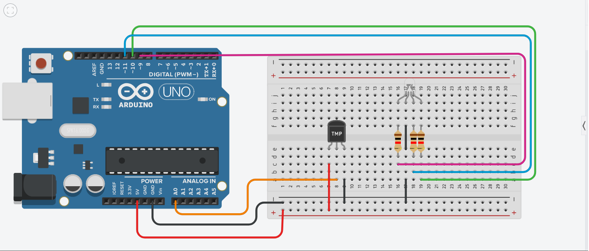

# Química - Reações Endotérmicas e Exotérmicas
## Componentes:

### Sensor LM35:

O Sensor de temperatura LM35 possui 3 pinos (VCC, GND, VOUT).

        VCC: Fornece energia ao sensor;
        GND: Fornece uma referÊncia de terra;
        VOUT: Envia os dados, em Celsius, para o arduino.

Medição da velocidade

O projeto consiste em simular as reações químicas endotérmicas e exotérmicas com o auxílio do sensor LM35.
Materias necessários

        Placa Arduino;
        1 LED RGB;
        1 Sensor de temperatura LM35;
        Protoboard;
        Cabos jumper;
        3 Resistor de 220Ω;
        Software Arduino IDE / VSCode (com a biblioteca pyfirmata).
    
## Montagem do Circuito:
### Sensor de Temperatura LM35:
    
        Vcc ao 5V do Arduino.
        GND ao GND do Arduino.
        Vout ao pino A0 do Arduino.
        
### LED RGB:
    
        Pino R (vermelho) ao pino digital D9 do Arduino (com resistor de 220Ω).
        Pino G (verde) ao pino digital D10 do Arduino (com resistor de 220Ω).
        Pino B (azul) ao pino digital D11 do Arduino (com resistor de 220Ω).
        GND ao GND do Arduino.
        
### Código:
```
    const int tempPin = A0;  // Pino do sensor de temperatura LM35
    const int redPin = 9;    // Pino do LED RGB (vermelho)
    const int greenPin = 10; // Pino do LED RGB (verde)
    const int bluePin = 11;  // Pino do LED RGB (azul)
    
    void setup() {
      Serial.begin(9600);
      pinMode(redPin, OUTPUT);
      pinMode(greenPin, OUTPUT);
      pinMode(bluePin, OUTPUT);
    }
    
    void loop() {
      int tempValue = analogRead(tempPin);
      float tempCelsius = (tempValue / 1024.0) * 500.0;
      Serial.print("Temperatura: ");
      Serial.print(tempCelsius);
      Serial.println(" °C");
    
      if (tempCelsius < 25) {
        setColor(0, 0, 255); // Azul (Endotérmica)
      } else if (tempCelsius > 30) {
        setColor(255, 0, 0); // Vermelho (Exotérmica)
      } else {
        setColor(0, 255, 0); // Verde (Normal)
      }
    
      delay(1000);
    }
    
    void setColor(int red, int green, int blue) {
      analogWrite(redPin, red);
      analogWrite(greenPin, green);
      analogWrite(bluePin, blue);
    }
```


## Imagens Circuito:
1. Circuito completo


 2. Esquemática


3. Reação exotérmica


Explicação
