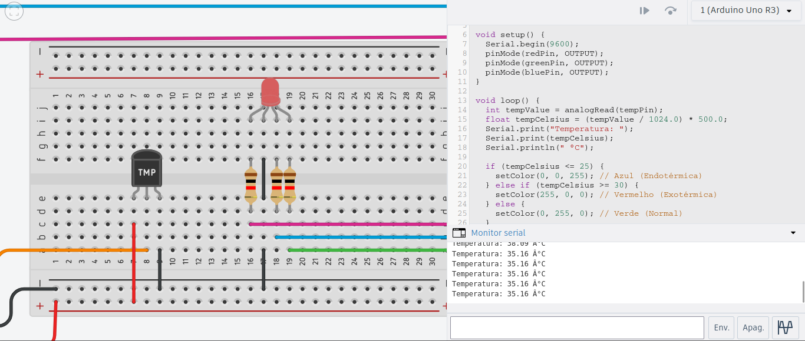
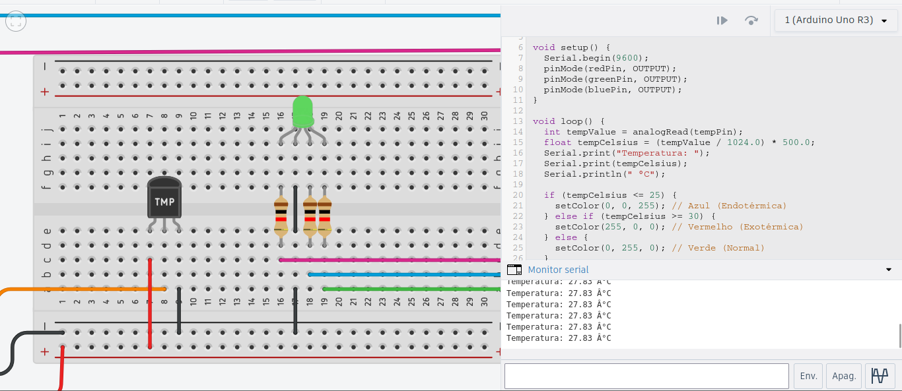

# Química - Reações Endotérmicas e Exotérmicas
## Componentes:

### Sensor LM35:

O Sensor de temperatura LM35 possui 3 pinos (VCC, GND, VOUT).

    VCC: Fornece energia ao sensor;
    GND: Fornece uma referÊncia de terra;
    VOUT: Envia os dados, em Celsius, para o arduino.

O projeto consiste em simular as reações químicas endotérmicas e exotérmicas com o auxílio do sensor LM35.
Materias necessários

    Placa Arduino;
    1 LED RGB;
    1 Sensor de temperatura LM35;
    Protoboard;
    Cabos jumper;
    3 Resistor de 220Ω;
    Software Arduino IDE / VSCode (com a biblioteca pyfirmata).
    
## Montagem do Circuito:
### Sensor de Temperatura LM35:
    
    Vcc ao 5V do Arduino.
    GND ao GND do Arduino.
    Vout ao pino A0 do Arduino.
        
### LED RGB:
    
    Pino R (vermelho) ao pino digital D9 do Arduino (com resistor de 220Ω).
    Pino G (verde) ao pino digital D10 do Arduino (com resistor de 220Ω).
    Pino B (azul) ao pino digital D11 do Arduino (com resistor de 220Ω).
    GND ao GND do Arduino.
        
### Código:
~~~cpp
    const int tempPin = A0;  // Pino do sensor de temperatura LM35
    const int redPin = 9;    // Pino do LED RGB (vermelho)
    const int greenPin = 10; // Pino do LED RGB (verde)
    const int bluePin = 11;  // Pino do LED RGB (azul)
    
    void setup() {
        Serial.begin(9600);
        pinMode(redPin, OUTPUT);
        pinMode(greenPin, OUTPUT);
        pinMode(bluePin, OUTPUT);
    }
    
    void loop() {
        int tempValue = analogRead(tempPin);
        float tempCelsius = (tempValue / 1024.0) * 500.0;
        Serial.print("Temperatura: ");
        Serial.print(tempCelsius);
        Serial.println(" °C");

        if (tempCelsius < 25) {
            setColor(0, 0, 255); // Azul (Endotérmica)
        } else if (tempCelsius > 30) {
            setColor(255, 0, 0); // Vermelho (Exotérmica)
        } else {
            setColor(0, 255, 0); // Verde (Normal)
        }
        
        delay(1000);
    }
    
    void setColor(int red, int green, int blue) {
        analogWrite(redPin, red);
        analogWrite(greenPin, green);
        analogWrite(bluePin, blue);
    }
~~~

## Imagens Circuito:
#### Circuito completo

#### Esquemática

#### Reação exotérmica

#### Reação endotérmica

#### Estado normal 

## Detalhes da Simulação:

### Configuração do Sensor de Temperatura:
O LM35 fornece uma leitura analógica proporcional à temperatura. 
A leitura é convertida para graus Celsius no código Python usando a fórmula temp_value * 5.0 * 100.0.

### Controle do LED RGB:
Utilizamos os pinos digitais 9, 10 e 11 do Arduino para controlar as cores do LED RGB.
A função set_color(red, green, blue) ajusta a intensidade de cada cor (0 a 1).

### Reações Simuladas:
- Reação Endotérmica: Indicada pela cor azul quando a temperatura é menor que 25°C.
- Reação Exotérmica: Indicada pela cor vermelha quando a temperatura é maior que 30°C.
- Estado Normal: Indicada pela cor verde quando a temperatura está entre 25°C e 30°C.

### Testes e Ajustes:
Após a montagem e programação, é essencial testar o funcionamento do sistema.
Utilize diferentes fontes de calor e frio para observar as mudanças na cor do LED RGB.
