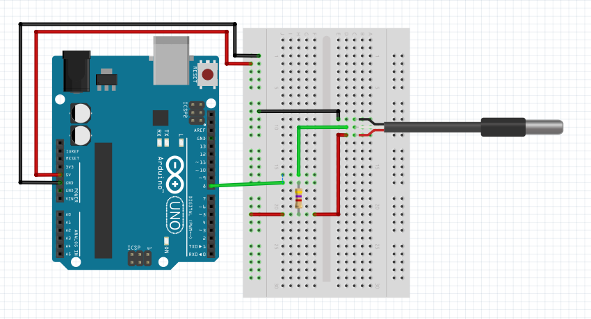
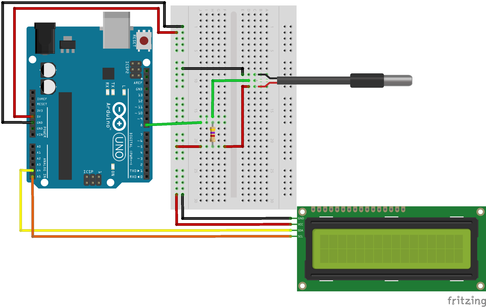
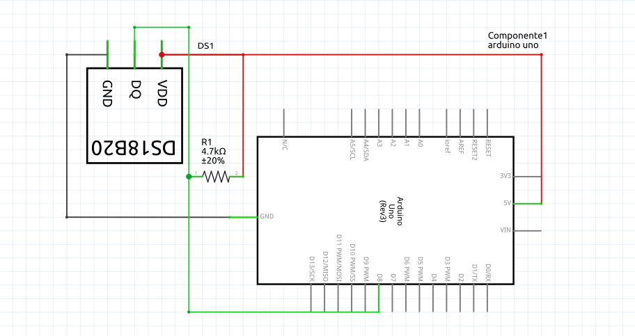
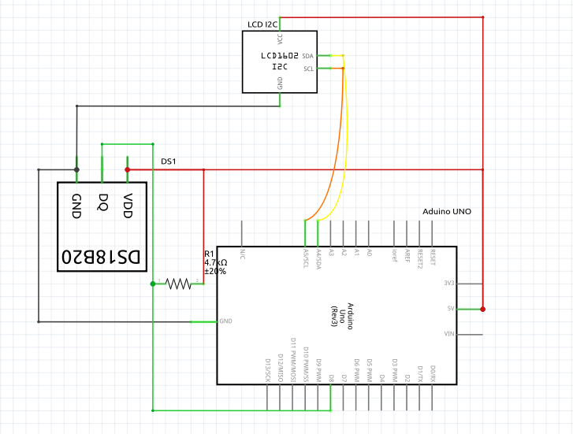

# Química - Reações Endotérmicas e Exotérmicas
## Componentes:

### Sensor DS18B20 (sonda):

O Sensor de temperatura DS18B20 (sonda) possui 3 pinos (VCC, GND, DATA).

    VCC: Fornece energia ao sensor;
    GND: Fornece uma referência de terra;
    DATA: Envia os dados, em Celsius, para o arduino.

O projeto consiste em simular as reações químicas endotérmicas e exotérmicas com o auxílio do sensor DS18B20 (sonda).
Materias necessários

    a. Placa Arduino com cabo USB;
    b. Resistor de Pull UP 4.7kΩ - 10kΩ;
    c. Sensor de temperatura DS18B20 à prova d’água;
    d. Display LCD 16x2 com I2C;
    e. Protoboard;
    f. Cabos jumper;
    g. Arduino IDE ou VSCode;
    h. Bibliotecas OneWire, Dallas e LiquidCrystal, Pyfirmata;
    i. Reagentes para as reações químicas exotérmicas e endotérmicas.
    
## Montagem do Circuito:
### Sensor de Temperatura DS18B20 (sonda):

    VCC: Conectado ao 5V do Arduino
    GND: Conectado ao GND do Arduino
    DATA: Conectado ao pino digital 2 do Arduino com um resistor de pull-up de 4.7kΩ entre VCC e DATA

### Display LCD 16x2 com I2C:

    Vcc: Conectado ao 5V do Arduino
    GND: Conectado ao GND do Arduino
    SDA: Conectado ao pino A4 do Arduino
    SCL: Conectado ao pino A5 do Arduino
        
## Imagens Circuito:
Feito no Fritzing

#### Circuito completo:
 

#### Esquemática:
 

## Detalhes da Simulação:

### Configuração do Sensor de Temperatura :
O DS18B20 fornece uma leitura digital da temperatura. A leitura é obtida diretamente no código Arduino e Python.
O DS18B20 fornece um sinal digital (8 bits) da temperatura. A leitura é obtida diretamente no código Arduino e/ou Python. Para lermos esse sinal precisamos do resistor de Pull UP. Caso contrário, obtemos uma leitura falsa da temperatura. 

O resistor de Pull UP serve para o sensor adquirir o status 1 ou 0.

### Testes e Ajustes:
Após a montagem e programação, é essencial testar o funcionamento do sistema.
