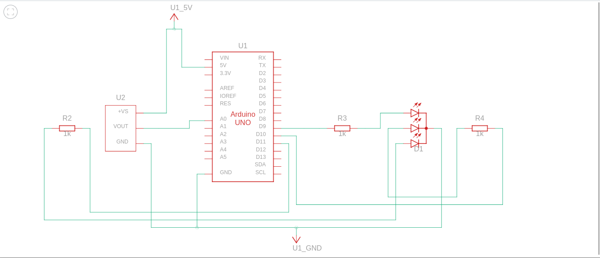

# Química - Reações Endotérmicas e Exotérmicas
## Componentes:

### Sensor DS18B20 (sonda):

O Sensor de temperatura DS18B20 (sonda) possui 3 pinos (VCC, GND, DATA).

    VCC: Fornece energia ao sensor;
    GND: Fornece uma referência de terra;
    DATA: Envia os dados, em Celsius, para o arduino.

O projeto consiste em simular as reações químicas endotérmicas e exotérmicas com o auxílio do sensor DS18B20 (sonda).
Materias necessários

    a. Placa Arduino com cabo USB;
    b. Resistor de Pull UP 4.7kΩ - 10kΩ;
    c. Sensor de temperatura DS18B20 à prova d’água;
    d. Display LCD 16x2;
    e. Protoboard;
    f. Cabos jumper;
    g. Arduino IDE ou VSCode;
    h. Bibliotecas OneWire, Dallas e LiquidCrystal, Pyfirmata;
    i. Reagentes para as reações químicas exotérmicas e endotérmicas.
    
## Montagem do Circuito:
### Sensor de Temperatura DS18B20 (sonda):

    GND ao GND do Arduino;
    Vcc ao 5V do Arduino;
    DATA a um pino digital (2-13) do Arduino;
    Resistor Pull UP entre o VCC e o DATA do sensor.
        
        
## Imagens Circuito:
#### Circuito completo

#### Esquemática

#### Reação exotérmica

#### Reação endotérmica

#### Estado normal 

## Detalhes da Simulação:

### Configuração do Sensor de Temperatura :
O DS18B20 (sonda) fornece um sinal digital em 8 bits, para lermos esse sinal precisamos do resistor de Pull UP. 
Caso contrário, obtemos uma leitura falsa da temperatura. 

O resistor de Pull UP serve para o sensor adquirir o status 1 ou 0.

### Testes e Ajustes:
Após a montagem e programação, é essencial testar o funcionamento do sistema.
